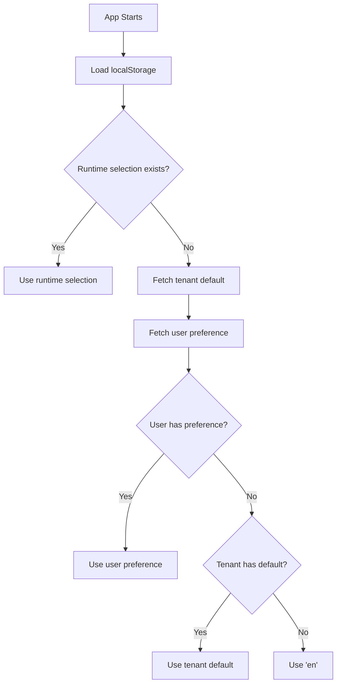
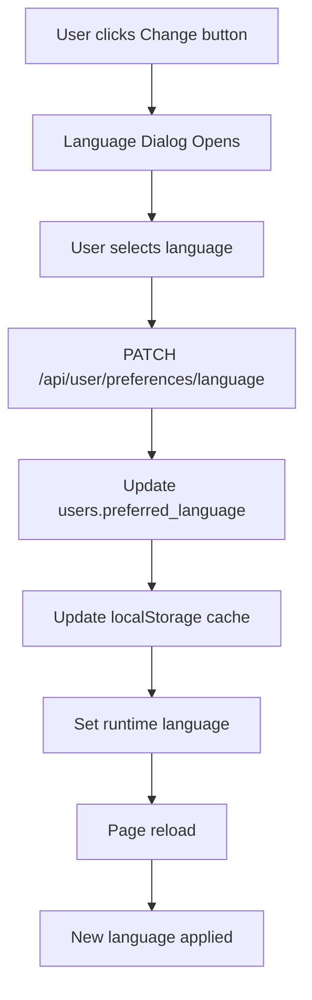

# Complete Localization Implementation Summary

## Overview
This document summarizes the complete localization (language preference) system implemented across the platform, supporting both organization-level defaults and individual user preferences.

## Three-Tier Language Control System

### 1. **Organization Level** (Tenant Default)
- **Who controls**: Organization admins
- **Where**: Admin > Settings > Organization > Localization section
- **What it does**: Sets the default language for all users in the organization
- **Priority**: Fallback when user has no personal preference

### 2. **User Level** (Personal Preference)
- **Who controls**: Individual users
- **Where**: User Profile > Preferences Tab > Regional Settings
- **What it does**: Overrides organization default with user's preferred language
- **Priority**: Higher than organization default, lower than runtime selection

### 3. **Runtime Level** (Session Selection)
- **Who controls**: Any user (admin or regular user)
- **Where**: Language switcher in header (globe icon)
- **What it does**: Temporarily changes language for current session
- **Priority**: Highest - overrides all other settings until page reload

## Language Selection Priority (Highest to Lowest)

```
1. Runtime Selection (localStorage: 'admin_language' or 'user_language')
   ↓ If not set
2. User's Preferred Language (Database: users.preferred_language)
   ↓ If not set
3. Admin/User Cross-Context Fallback (User inherits admin if not set)
   ↓ If not set
4. Tenant's Default Language (Database: tenants.default_language)
   ↓ If not set
5. System Default ('en' - English)
```

---

## Files Modified/Created

### Database Changes
1. **`supabase/SQL Scripts/20250101_add_user_preferred_language.sql`**
   - Added `preferred_language` column to `users` table
   - Nullable field (NULL = use tenant default)
   - Indexed for performance

### API Endpoints

2. **`src/app/api/user/profile/route.ts`** (Modified)
   - **GET**: Returns user's `preferred_language` in preferences.regional.language
   - **PATCH**: Accepts `preferred_language` field for updates
   - Audit logging for language preference changes

3. **`src/app/api/user/preferences/language/route.ts`** (New)
   - **PATCH**: Dedicated endpoint for updating language preference
   - Validates language codes (en, he, es, fr)
   - Returns updated preference
   - Full audit trail

### Components

4. **`src/components/user/LanguagePreferenceDialog.tsx`** (New)
   - Modal dialog for selecting preferred language
   - Shows 5 options: Auto (Organization Default), English, Hebrew, Spanish, French
   - Visual selection with checkmarks
   - Saves to database and updates runtime language
   - Triggers page reload to apply changes

5. **`src/app/(user)/profile/page.tsx`** (Modified)
   - Added language preference display in Preferences tab
   - Shows current language with proper formatting
   - "Change" button opens LanguagePreferenceDialog
   - Refreshes profile data after language change

### Context & State Management

6. **`src/context/AppContext.tsx`** (Modified)
   - Updated `getInitialLanguage()` function with 5-tier priority system
   - Added `fetchLanguagePreferences()` useEffect
   - Fetches tenant's `default_language` from `/api/admin/tenant`
   - Fetches user's `preferred_language` from `/api/user/profile`
   - Caches both in localStorage for fast initialization
   - Changed final fallback from 'he' to 'en'

---

## How It Works

### App Initialization Flow



### User Changes Language Flow



---

## Usage Examples

### Example 1: New User, First Login
**Scenario**: User logs in for first time, no preferences set
```
1. Check localStorage (runtime) → Not set
2. Check user.preferred_language → NULL
3. Check tenant.default_language → 'he' (Hebrew)
4. User sees Hebrew interface ✅
```

### Example 2: User Sets Personal Preference
**Scenario**: User in Hebrew organization prefers English
```
1. User opens Profile > Preferences
2. Clicks "Change" next to Language
3. Selects "English"
4. System saves preferred_language = 'en'
5. Page reloads
6. User now sees English interface ✅
7. Overrides tenant default (he) with personal preference (en)
```

### Example 3: Runtime Language Switch
**Scenario**: User temporarily switches language
```
1. User clicks globe icon in header
2. Selects different language
3. Saves to localStorage only
4. Interface changes immediately
5. After page reload → Returns to personal preference or tenant default
```

### Example 4: Admin Changes Organization Default
**Scenario**: Admin changes tenant default from Hebrew to English
```
1. Admin goes to Settings > Organization
2. Changes Default Language to English
3. Saves changes
4. New users now see English by default
5. Existing users with personal preferences → Unaffected
6. Existing users without preferences → See English on next login
```

---

## Translation Keys Added

For the language preference dialog and profile section, add these translation keys:

```json
{
  "user.profile.preferences.language": "Language",
  "user.profile.preferences.languageAuto": "Auto (Organization Default)",
  "user.profile.preferences.selectLanguage": "Select Your Preferred Language",
  "user.profile.preferences.languageDescription": "Choose the language you want to use for the interface. This will override the organization default.",
  "user.profile.preferences.availableLanguages": "Available Languages",
  "user.profile.preferences.languageUpdated": "Language preference updated successfully",
  "user.profile.preferences.languageUpdateError": "Failed to update language preference"
}
```

---

## Testing Checklist

- [ ] Run SQL migration to add `preferred_language` column
- [ ] Test organization default language setting (Admin side)
- [ ] Test user language preference dialog (User side)
- [ ] Test language priority:
  - [ ] No preferences → Uses tenant default
  - [ ] User sets preference → Overrides tenant default
  - [ ] Runtime switch → Overrides everything temporarily
- [ ] Test language persistence across page reloads
- [ ] Test "Auto" option (clears user preference, uses tenant default)
- [ ] Test with multiple users in same organization
- [ ] Test admin language vs user language separation
- [ ] Verify audit logs for language changes

---

## Benefits

1. **Organization Control**: Admins can set appropriate default for their region
2. **User Freedom**: Users can override with personal preference
3. **Temporary Switching**: Quick language switching without changing preferences
4. **Multi-Tenant Support**: Each organization can have different defaults
5. **Audit Trail**: All language changes are logged
6. **Performance**: Cached preferences for fast initialization
7. **Graceful Fallbacks**: Multiple levels prevent users from seeing unsupported languages

---

## Future Enhancements

1. Add more language options (Arabic, German, Chinese, etc.)
2. Auto-detect browser language on first visit
3. Per-module language preferences (e.g., reports in one language, UI in another)
4. Language proficiency levels (beginner, intermediate, advanced translations)
5. Custom language packs for specialized terminology
6. RTL/LTR layout improvements for better Arabic/Hebrew support

---

## Developer Notes

### Adding a New Language

1. **Add language to the `languages` table in the database**:
   ```sql
   INSERT INTO languages (code, name, native_name, direction, is_active, is_default)
   VALUES ('fr', 'French', 'Français', 'ltr', true, false);
   ```

2. **Add to `rtlLanguages` array in `AppContext.tsx` if RTL**:
   ```typescript
   const rtlLanguages = ['he', 'ar', 'fa', 'ur', 'yi'];
   ```

3. **Create translation files** in your translations system (add rows to `translations` table)

4. **Test with users** - The language will automatically appear in:
   - Admin Organization Settings dropdown
   - User Profile language preference dialog
   - Language switcher in header

**Note**: The language dropdowns and dialogs now automatically fetch and display only **active** languages from the database. No hardcoding needed!

### Debugging Language Issues

```javascript
// Check current language state in browser console:
console.log({
  runtime_admin: localStorage.getItem('admin_language'),
  runtime_user: localStorage.getItem('user_language'),
  user_preference: localStorage.getItem('user_preferred_language'),
  tenant_default: localStorage.getItem('tenant_default_language'),
  current_admin: adminLanguage,
  current_user: userLanguage
});
```

---

## Deployment Steps

1. **Deploy SQL Migration**
   ```sql
   -- Run: supabase/SQL Scripts/20250101_add_user_preferred_language.sql
   ```

2. **Deploy Code Changes**
   - All modified/new files included in this implementation

3. **Verify API Endpoints**
   ```bash
   # Test tenant endpoint
   curl -X GET /api/admin/tenant

   # Test user profile endpoint
   curl -X GET /api/user/profile

   # Test language preference endpoint
   curl -X PATCH /api/user/preferences/language \
     -H "Content-Type: application/json" \
     -d '{"preferred_language":"en"}'
   ```

4. **Clear Browser Cache**
   - Users may need to clear localStorage to see changes
   - Or manually remove old keys: `localStorage.removeItem('tenant_default_language')`

---

## Support & Troubleshooting

### Issue: User's language keeps resetting
**Solution**: Check if `preferred_language` is properly saved in database. Verify API endpoint is working.

### Issue: Organization default not applying
**Solution**: Check `tenants.default_language` field. Verify AppContext is fetching it correctly.

### Issue: Runtime switch not working
**Solution**: Check `localStorage` for `admin_language` or `user_language` keys. Clear and try again.

### Issue: Wrong language on first load
**Solution**: Check priority hierarchy. Clear `localStorage` and reload page to test clean state.

---

**Implementation Date**: 2025-01-01
**Last Updated**: 2025-01-01
**Version**: 1.0
